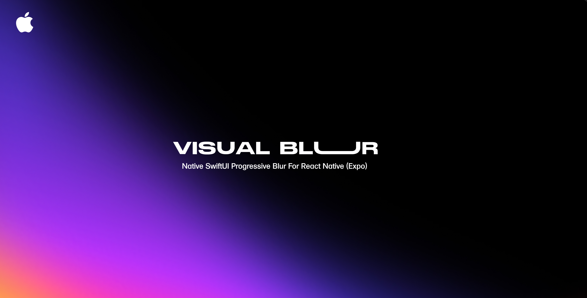

<p align="center">
  
</p>

<h1 align="center">🎨 expo-ios-visual-blur</h1>

<p align="center">
  Native SwiftUI progressive blur for React Native (Expo) on iOS — dynamic, smooth, and configurable.
</p>

<p align="center">
  
  
  
</p>

<p align="center">
  
</p>

https://github.com/user-attachments/assets/e91662cb-a8c8-4f3e-ab9b-2caa3e31b85b

## ✨ Features

- 🍎 **Native SwiftUI implementation** for performant and smooth blur effects on iOS
- 🌈 **Progressive variable blur** with customizable max blur radius
- 🔄 **Directional blur gradients:** blurred top to clear bottom or blurred bottom to clear top
- 🎨 Supports **start offset** control for where blur begins vertically
- ⚙️ Dynamic, runtime-updatable blur parameters with seamless transitions
- 🖼️ Can overlay on any React Native view with children support
- 🚫 Safe area aware, or choose to ignore it for fullscreen effects
- 🎭 Optional masking and flexible styling via React Native props
- 📱 **Exclusive iOS support** using native UIVisualEffectView + CAFilter for advanced blur control

---

## 🚀 Installation

### 1. Add the package

```bash
npx expo install expo-ios-visual-blur
```

### 2. Install CocoaPods dependencies

```bash
cd ios && pod install
```

### 3. (Optional) Prebuild the iOS project if you use bare workflow or custom native code

```bash
npx expo prebuild --platform ios
```

### 4. Run your app

```bash
pnpm ios
# or
npx expo run:ios
```

> ⚠️ **Note:** This module uses SwiftUI and iOS-only native APIs — it does **not** support Android or other platforms.

---

## 📦 Usage

```tsx
import React from "react";
import { BlurView, BlurViewDirection } from "expo-ios-visual-blur";
import { Image } from "react-native";

export default function App() {
  return (
    <BlurView
      direction={BlurViewDirection.BlurredBottomClearTop}
      maxBlurRadius={21}
      startOffset={0.1}
      style={{ borderRadius: 10, overflow: "hidden" }}
    >
      <Image
        source={{
          uri: "https://images.unsplash.com/photo-1754638069174-7aa06c176b61?q=80&w=1364&auto=format&fit=crop&ixlib=rb-4.1.0&ixid=M3wxMjA3fDB8MHxwaG90by1wYWdlfHx8fGVufDB8fHx8fA%3D%3D",
        }}
        style={{ width: 200, height: 200 }}
      />
    </BlurView>
  );
}
```

---

## ⚙️ Props

| Prop            | Type                | Default                   | Description                                                          |
| --------------- | ------------------- | ------------------------- | -------------------------------------------------------------------- |
| `maxBlurRadius` | `number`            | `20`                      | Maximum blur radius applied to the view                              |
| `direction`     | `BlurViewDirection` | `"blurredTopClearBottom"` | Direction of the blur gradient — from top to bottom or bottom to top |
| `startOffset`   | `number` (0 to 1)   | `0`                       | Starting point of the blur gradient (relative vertical offset)       |
| `style`         | `ViewStyle`         | `undefined`               | Custom styles applied to the container view                          |
| `children`      | `React.ReactNode`   | `undefined`               | React Native children to render inside the blur                      |

---

## 🔤 `BlurViewDirection` Enum

| Direction               | Description                   |
| ----------------------- | ----------------------------- |
| `BlurredTopClearBottom` | Blur fades from top to bottom |
| `BlurredBottomClearTop` | Blur fades from bottom to top |

---

## 📱 Platform Support

| Platform | Support                      |
| -------- | ---------------------------- |
| iOS      | ✅ Fully supported (SwiftUI) |
| Android  | ❌ Not supported             |
| Web      | ❌ Not supported             |

---

## 🛠 Built With

- ⚛️ [React Native](https://reactnative.dev/) & [Expo](https://expo.dev/)
- 🍎 [SwiftUI](https://developer.apple.com/xcode/swiftui/)
- 🧪 Native iOS `UIVisualEffectView` with custom `CAFilter` for variable blur

---

## ❤️ Contributing

Contributions, issues, and feature requests are welcome! Feel free to open a pull request or issue.

---

## 📄 License

MIT © [rit3zh](https://github.com/rit3zh)
